<div align="center">

# Decarbonizing Water Desalination by Optimizing Renewable Energy and Battery Storage Using Optimization Algorithms

---

[](LICENSE)
[](https://www.python.org/)
[](https://dash.plotly.com/)
[](https://pymoo.org/)
[](https://xgboost.readthedocs.io/)

[](docs/papers/IDRA-WC-2024-Sanan-Decarbonizing-Desalination.pdf)
[](docs/papers/IEEE-SusTech-2024-Sanan-Forecasting-RE-Desalination.pdf)
[](docs/papers/IDRA-2024-Optimization-Presentation.pptx)

[**📖 Publications**](#-publications--talks) • [**🏗 Architecture**](#-system-architecture) • [**🚀 Quick Start**](#-quick-start) • [**📈 Results**](#-headline-results) • [**📝 Cite**](#-citation)

</div>

<p align="center">
  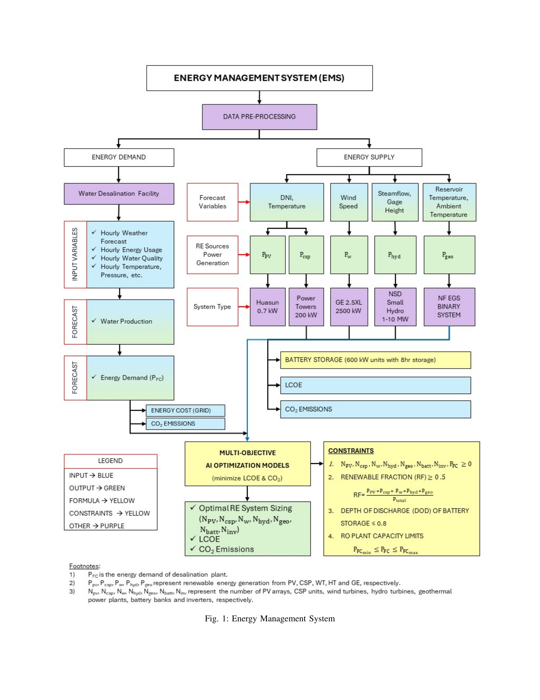
  <br/>
  <em><b>Figure 1.</b> The Energy Management System (EMS) framework — featured in our IEEE SusTech 2024 paper. Data preprocessing flows into parallel <b>energy demand</b> and <b>energy supply</b> branches, where forecasted weather variables drive five renewable‑energy generators (PV, CSP, Wind, Hydro, Geothermal). Outputs feed a multi‑objective optimizer that minimizes LCOE and CO₂ subject to RE‑fraction, depth‑of‑discharge, and plant‑capacity constraints.</em>
</p>

---

> ### 📰 News & What's Inside
>
> | When | What |
> |---|---|
> | **Dec 2024** | 🎤 Presented at the **[IDRA World Congress 2024](docs/papers/IDRA-2024-Optimization-Presentation.pptx)** in Abu Dhabi |
> | **Sep 2024** | 📄 [IDRA WC 2024 paper](docs/papers/IDRA-WC-2024-Sanan-Decarbonizing-Desalination.pdf) — multi‑objective RE+battery optimization with PSO |
> | **Apr 2024** | 📄 [IEEE SusTech 2024 paper](docs/papers/IEEE-SusTech-2024-Sanan-Forecasting-RE-Desalination.pdf) — comprehensive forecasting framework (PV · Wind · CSP · **Geothermal** · Hydro) |

---

## 📑 Table of Contents

<details open>
<summary><b>Click to expand / collapse</b></summary>

- [✨ Highlights](#-highlights)
- [🎯 Headline Results](#-headline-results)
- [📖 Publications & Talks](#-publications--talks)
- [🌍 Why This Project](#-why-this-project)
- [🏗 System Architecture](#-system-architecture)
- [🔬 Methodology Pipeline](#-methodology-pipeline)
- [🏭 Desalination Plants Studied](#-desalination-plants-studied)
- [📡 Forecasting (Step 1)](#-forecasting-step-1)
- [⚡ Renewable Energy Generation Models (Step 2)](#-renewable-energy-generation-models-step-2)
- [💰 Cost & CO₂ Assumptions (Step 3)](#-cost--co-assumptions-step-3)
- [🎛 Multi‑Objective Optimization (Step 4)](#-multi-objective-optimization-step-4)
- [📈 Optimization Results — Tampa Bay](#-optimization-results--tampa-bay)
- [🚀 Quick Start](#-quick-start)
- [📂 Repository Layout](#-repository-layout)
- [🔧 Configuration Reference](#-configuration-reference)
- [🔭 Limitations & Future Work](#-limitations--future-work)
- [📝 Citation](#-citation)
- [📄 License & Acknowledgments](#-license--acknowledgments)

</details>

---

## ✨ Highlights

<table>
<tr>
<td width="33%" align="center" valign="top">

### 🤖 Real Data, Not Toys

<sub>5–10 years of **hourly/daily** operating data from **4 real U.S. desalination plants** plus 20 years of NSRDB weather. No simulated toy datasets.</sub>

</td>
<td width="33%" align="center" valign="top">

### 🔮 ML Forecasting

<sub>**Gradient Boosting** + **XGBoost Average Method** + **Prophet** + **SARIMA** ensembles. Normalized RMSE **< 10%** on water, energy, temp, wind.</sub>

</td>
<td width="33%" align="center" valign="top">

### 🧬 Multi‑Objective Optimization

<sub>**NSGA‑II** Pareto fronts + **PSO** scalarized — co‑optimizes PV · Wind · CSP · Battery sizing to jointly minimize **cost** and **CO₂**.</sub>

</td>
</tr>
<tr>
<td width="33%" align="center" valign="top">

### 🌐 Interactive Apps

<sub>**Dash** app for optimization (Pareto explorer + scenario builder). **Streamlit** app for weather forecasting from any lat/lon via NREL NSRDB.</sub>

</td>
<td width="33%" align="center" valign="top">

### 🌳 Real Climate Impact

<sub>At Tampa Bay: **99% RE mix at ~same cost as utility, with −98% CO₂**. Equivalent to **planting 4.1 million trees over 5 years**.</sub>

</td>
<td width="33%" align="center" valign="top">

### 📊 Reproducible

<sub>Per‑plant Jupyter notebooks · saved `.pkl` models · open data formats · NREL ATB cost basis · Dockerized Dash app.</sub>

</td>
</tr>
</table>

---

## 🎯 Headline Results

For the **Tampa Bay** desalination plant (5‑year horizon, 2023–2027):

<div align="center">

| Scenario | RE Mix | Battery | 5‑Yr Cost | CO₂ (g/kWh, lifetime) | vs. Baseline |
|:---|:---:|:---:|---:|---:|:---:|
| **Baseline** (100% utility) | 0% | — | $16.9 M | 90.0 B | — |
| **Scenario 3** (0–30% RE) | 30% | None | $16.9 M | 62.5 B | ≈ same cost · **−31% CO₂** |
| **🏆 Scenario 2** (50–100% RE) | **99%** | None | **$16.8 M** | 1.4 B | **−1% cost · −98% CO₂** |
| **Scenario 1** (100% RE) | 100% | 12 batteries | $25.0 M | 5 M | +40% cost · **−99.99% CO₂** |

</div>

> 🌳 A **100% RE mix at Tampa Bay** would cut CO₂ emissions equivalent to **planting 4.1 million trees over 5 years**.
>
> 🏭 Across all four plants, converting from utility to **100% RE** would eliminate **~32,000 metric tons** of annual carbon emissions — equivalent to **planting 1.2 million trees**.

---

## 📖 Publications & Talks

This repository accompanies three publications/presentations. **All three are checked into the repo under [`docs/papers/`](docs/papers/)** so they're permanently linkable and downloadable.

<table>
<tr>
<td width="33%" valign="top">

### 📄 IDRA WC 2024 Paper

[**`IDRA-WC-2024-Sanan-Decarbonizing-Desalination.pdf`**](docs/papers/IDRA-WC-2024-Sanan-Decarbonizing-Desalination.pdf)

> *"Decarbonizing Water Desalination by Optimizing Renewable Energy and Battery Storage Using Optimization Algorithms"*

International Desalination & Water Reuse Association — World Congress, **Abu Dhabi, December 2024**.

**Focus:** PSO‑based co‑optimization of PV/Wind/CSP/Battery mix with three scenarios (100% / 50–100% / 0–30% RE). Includes Tampa Bay deep‑dive with cost & CO₂ trade‑off analysis.

</td>
<td width="33%" valign="top">

### 📄 IEEE SusTech 2024 Paper

[**`IEEE-SusTech-2024-Sanan-Forecasting-RE-Desalination.pdf`**](docs/papers/IEEE-SusTech-2024-Sanan-Forecasting-RE-Desalination.pdf)

> *"Forecasting Weather and Energy Demand for Optimization of Renewable Energy and Energy Storage Systems for Water Desalination"*

IEEE Conference on Technologies for Sustainability (SusTech), **April 2024**.

**Focus:** The **earlier and more comprehensive** companion paper. Adds **Geothermal** and **Hydro** to the RE mix, documents power‑estimation formulas in detail, and establishes the **EMS architecture** ([Fig. 1 above](#)).

</td>
<td width="33%" valign="top">

### 🎤 IDRA 2024 Slide Deck

[**`IDRA-2024-Optimization-Presentation.pptx`**](docs/papers/IDRA-2024-Optimization-Presentation.pptx)

> 35‑slide presentation (December 2024)

Full visual walkthrough of the project: vision · background · methodology · forecasting results per plant · RE generation formulas · NSGA‑II + PSO · optimization results · conclusions.

A handful of figures from the deck are featured throughout this README.

</td>
</tr>
</table>

BibTeX entries live in the [Citation](#-citation) section at the bottom.

---

## 🌍 Why This Project

<table>
<tr>
<td width="50%" valign="top">

### The water problem

- **5.6 billion people** (~70% of the world) live in water‑insecure countries
- **2 billion people** lack safe drinking water (UNU‑INWEH, 2023)
- The crisis is expected to **worsen** with climate change and urban growth
- Reverse Osmosis (RO) is now operational in **>21,000 facilities** in 177 countries, growing **6.8% annually**

</td>
<td width="50%" valign="top">

### The energy problem

- Energy is **25–40% of total** desalination cost (>50% of opex)
- **>99% of plants run on fossil fuels** today
- Yet RE LCOE has fallen **PV −89% · Wind −69% · CSP −69%** (2010–2022, IRENA)
- RE is now **cheaper than utility** in many markets

</td>
</tr>
</table>

> ### 🔍 The Research Gap
> Existing literature is mostly **simulated or small‑scale**, and rarely co‑optimizes **multiple grid‑connected RE sources** across geographies using **real plant data**.
>
> This project closes that gap by combining **5–10 years of real hourly/daily operating data** from four U.S. plants with an **ML‑forecasting + multi‑objective‑optimization** framework — delivered as **two interactive web apps** plus reproducible notebooks.

---

## 🏗 System Architecture

The IEEE SusTech 2024 paper presents the full Energy Management System (EMS) framework as Figure 1 (shown at the top of this README). Below is the simplified Mermaid view.

```mermaid
flowchart LR
    subgraph DATA["Historical Data (5-10 years)"]
        H1["NSRDB Weather API<br/>10-yr hourly"]
        H2["Plant Operations<br/>5-yr hourly/daily"]
        H3["USGS Hydrology<br/>discharge / gage"]
    end

    subgraph FCAST["ML Forecasting Layer"]
        F1["Treated Water and Energy Demand<br/>RF, GB, SARIMA, Ensemble"]
        F2["Weather: Temp, Wind, GHI<br/>XGBoost, Prophet, Avg Method"]
        F3["Hydro: Discharge / Gage<br/>XGBoost"]
    end

    subgraph REGEN["RE Generation Models"]
        R1["PV Panels<br/>Huasun 0.7 kW"]
        R2["Wind Turbines<br/>GE 2.5XL, 2500 kW"]
        R3["CSP Power Towers<br/>200 kW, 10-hr storage"]
        R4["Hydro Turbines<br/>1-10 MW"]
        R5["Geothermal EGS<br/>NF Binary System"]
    end

    subgraph OPT["Multi-Objective Optimizer"]
        O1["Particle Swarm<br/>PSO"]
        O2["NSGA-II<br/>Genetic Algorithm"]
        O3{{"Minimize Cost<br/>Minimize CO2"}}
    end

    subgraph OUT["Outputs"]
        U1["Optimal n_pv, n_wt, n_csp, n_batt"]
        U2["Pareto Front"]
        U3["Cost / CO2 / RE-share<br/>by month and year"]
    end

    DATA --> FCAST
    FCAST --> REGEN
    REGEN --> OPT
    F1 --> OPT
    OPT --> O3
    O3 --> OUT

    classDef data fill:#dae8fc,stroke:#6c8ebf,color:#000
    classDef ml fill:#d5e8d4,stroke:#82b366,color:#000
    classDef gen fill:#ffe6cc,stroke:#d79b00,color:#000
    classDef opt fill:#f8cecc,stroke:#b85450,color:#000
    classDef out fill:#e1d5e7,stroke:#9673a6,color:#000
    class H1,H2,H3 data
    class F1,F2,F3 ml
    class R1,R2,R3,R4,R5 gen
    class O1,O2,O3 opt
    class U1,U2,U3 out
```

The framework is delivered as **two interactive web apps** + a set of **per‑plant analysis notebooks** (see [Repository Layout](#-repository-layout)).

---

## 🔬 Methodology Pipeline

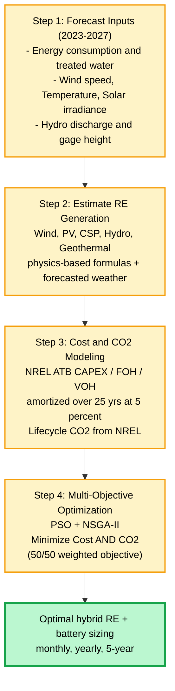

Each numbered section below maps to one step.

---

## 🏭 Desalination Plants Studied

Four real U.S. mid‑to‑large‑scale plants spanning **seawater** and **brackish‑water** RO:

<p align="center">
  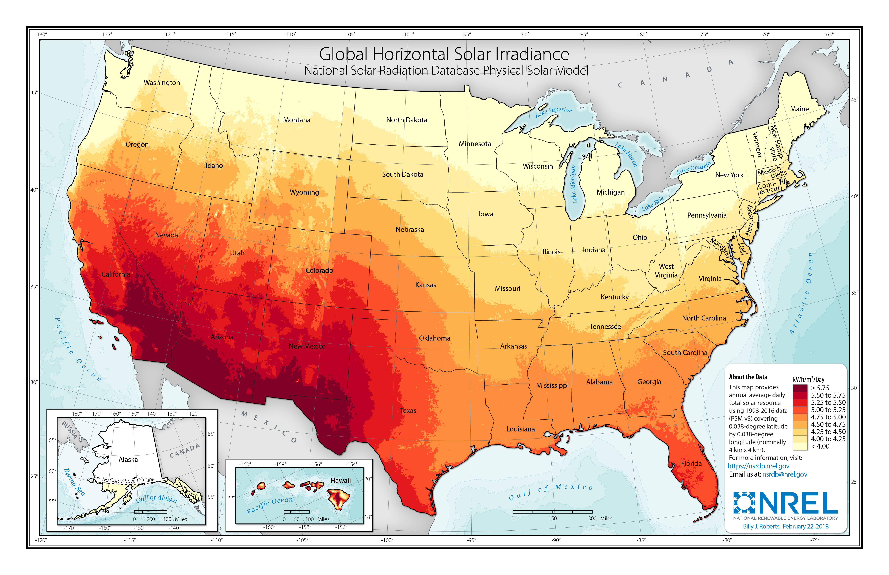
  <br/><em><b>Plant locations</b> overlaid on NREL’s annual GHI map: Tampa Bay (FL), SAWS (TX), Kay Bailey Hutchison (TX), Alameda County (CA).</em>
</p>

<div align="center">

| Plant | Type | TDS (ppm) | Capacity (MGD) | Annual Water (m³/yr) | Annual Energy (kWh/yr) | SEC (kWh/m³) |
|:---|:---:|---:|---:|---:|---:|---:|
| **Tampa Bay** (FL) | 🌊 Seawater | 35,000 | 8.2 | 11,288,134 | 43,023,680 | **3.81** |
| **Kay Bailey Hutchison** (TX) | 🚰 Brackish | 2,500 | 9.0 | 12,433,762 | 22,380,772 | 1.80 |
| **SAWS / San Antonio** (TX) | 🚰 Brackish | 1,325 | 3.9 | 5,349,394 | 5,019,000 | 0.94 |
| **Alameda County WD** (CA) | 🚰 Brackish | 1,111 | 6.7 | 9,198,486 | 4,205,916 | 0.46 |
| **Total** | | | **27.7** | **38.27 M** | **74.63 M** | 1.95 |

</div>

Combined electricity usage of the four plants is **~75 million kWh/year**.

---

## 📡 Forecasting (Step 1)

Two parallel forecasting tracks feed the optimization engine.

<table>
<tr>
<td width="50%" valign="top">

### A. Operations Forecasting

**Targets:** Daily treated water flow · Daily energy consumption

| | Detail |
|---|---|
| **Source** | 5 yrs plant ops (rainfall, hours of operation, raw water flows, backwash, peak demand, turbidity, pH) |
| **Models** | SARIMA · Random Forest · **Gradient Boosting** · XGBoost · Ensemble |
| **Tuning** | `GridSearchCV` over `n_estimators`, `learning_rate`, `max_depth` |
| **Split** | 60% train · 20% test · 20% validation |

</td>
<td width="50%" valign="top">

### B. Weather Forecasting

**Targets:** Temperature · Wind speed · Direct/Global irradiance

| | Detail |
|---|---|
| **Source** | 20 yrs hourly NSRDB via NREL API |
| **Models** | **XGBoost** · Prophet · **XGBoost Average Method** (novel) · LSTM |
| **Features** | Lag features (168 h = 1 wk), rolling stats, differencing |
| **Iterative forecast** | Multi‑year horizon with optional noise injection |

</td>
</tr>
</table>

<p align="center">
  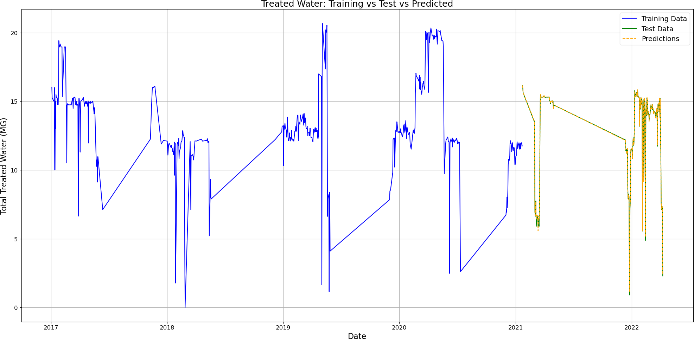
  <br/><em><b>Tampa Bay</b> — historical daily energy (kWh) and treated water (MGD); training 2017–2021, test 2022–2023.</em>
</p>

### 📊 Per‑Plant Forecast Results

<table>
<tr>
<td width="50%">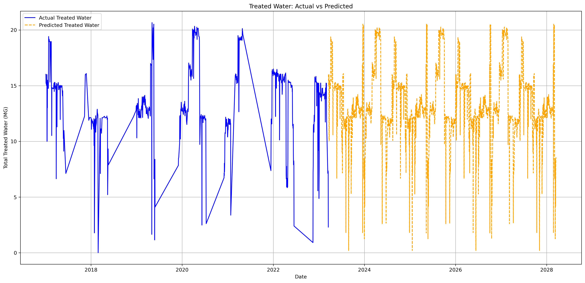</td>
<td width="50%">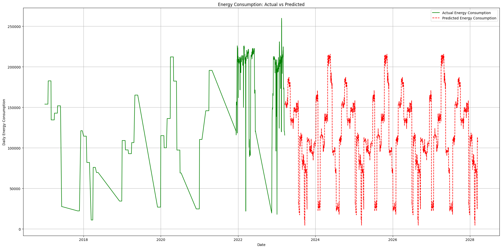</td>
</tr>
<tr>
<td colspan="2" align="center"><b>Tampa Bay</b> — treated water (left) and energy consumption (right)</td>
</tr>
<tr>
<td width="50%">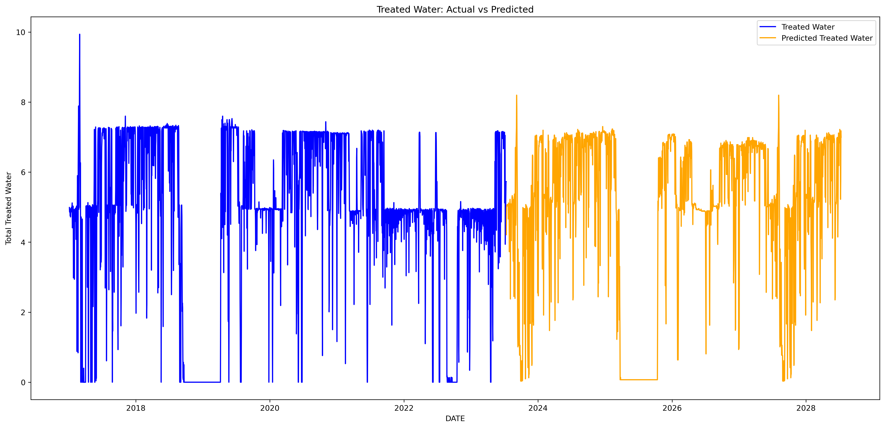</td>
<td width="50%">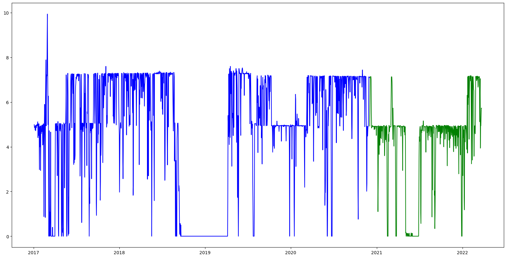</td>
</tr>
<tr>
<td colspan="2" align="center"><b>SAWS / San Antonio</b></td>
</tr>
<tr>
<td width="50%">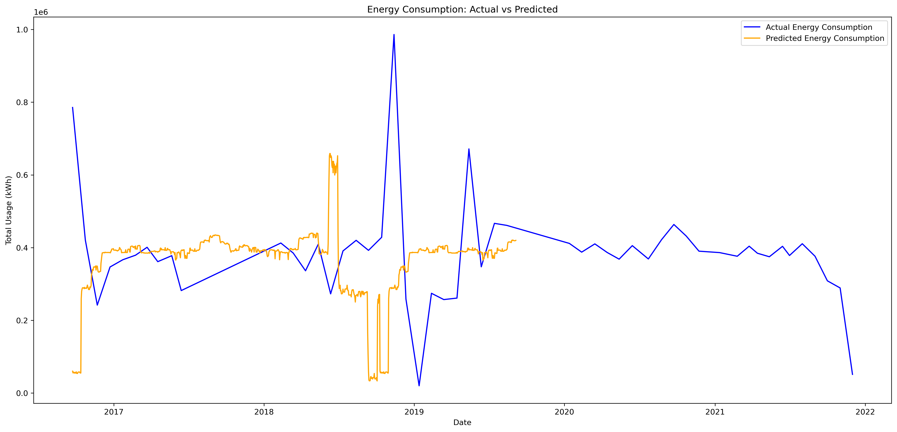</td>
<td width="50%">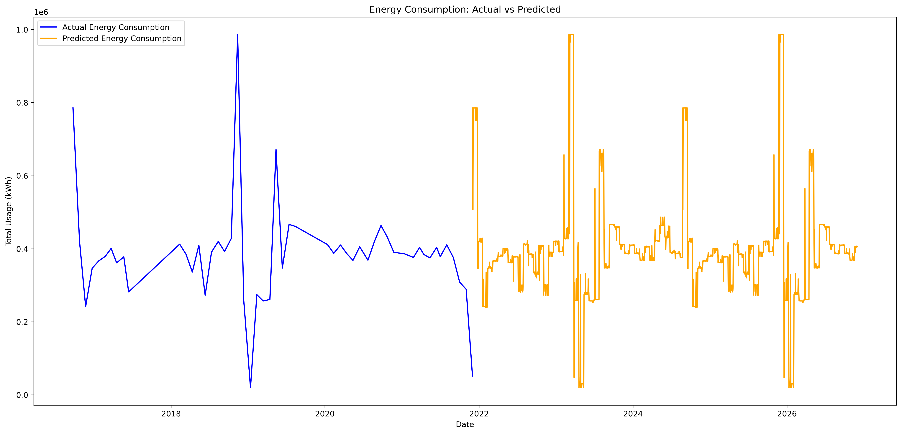</td>
</tr>
<tr>
<td colspan="2" align="center"><b>Alameda County Water District</b></td>
</tr>
<tr>
<td width="50%">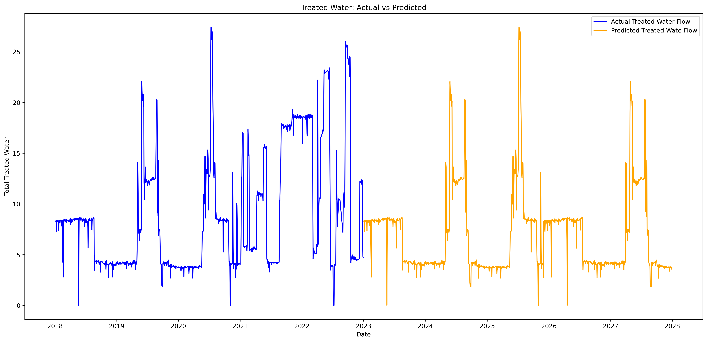</td>
<td width="50%">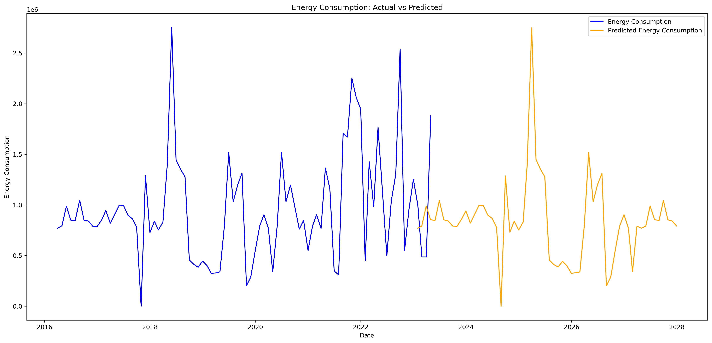</td>
</tr>
<tr>
<td colspan="2" align="center"><b>Kay Bailey Hutchison</b></td>
</tr>
</table>

<p align="center">
  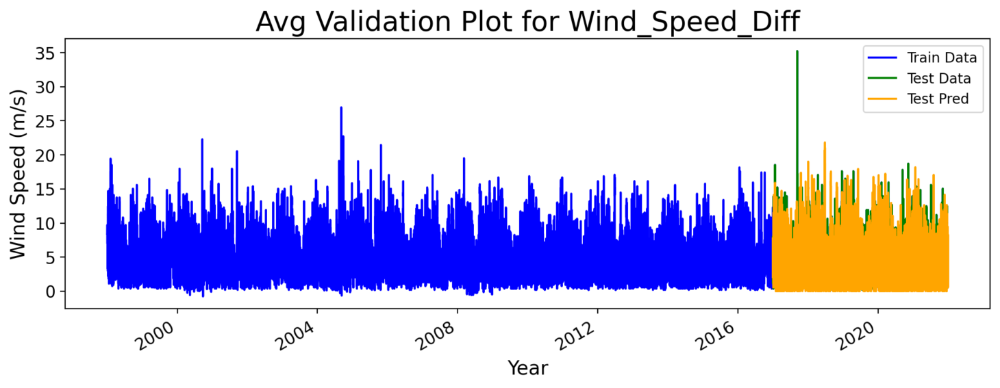
  <br/><em><b>Tampa Bay</b> — 5‑year weather forecasts (temperature, wind speed, GHI) using the XGBoost Average Method.</em>
</p>

> 📐 **Forecast accuracy:** Across all targets and locations, **normalized RMSE < 10%** for treated water flow, energy consumption, temperature, and wind speed; **< 20%** for GHI in challenging cases. **Gradient Boosting** and the **XGBoost Average Method** were the top performers.

---

## ⚡ Renewable Energy Generation Models (Step 2)

Forecasted hourly weather is converted to per‑unit power output via physics‑based formulas (see [`moo-ui/utility.py::calculate_re_production`](moo-ui/utility.py)).

<details>
<summary><b>☀️ Photovoltaic (PV)</b> — Huasun Himalaya G12 HJT, 0.7 kW per panel</summary>

```
T_cell = T_amb + (NOCT − 20) / 800
T_c    = 1 − β · (T_cell − 25)
P_pv   = (η_inv · η_b · η_r · T_c · A_pv · DNI) / 1000      # kW per panel
```
With `η_inv = 0.95`, `η_b = 1.00`, `η_r = 0.225`, `β = −0.0037`, `A_pv = 3.1 m²`, `NOCT = 44 °C`, `P_rated = 0.7 kW`.
</details>

<details>
<summary><b>🌬 Wind Turbine</b> — GE 2.5XL, 2,500 kW per turbine</summary>

```
P_w = ½ · ρ · A · v³ · Cp / 1000      # kW per turbine
```
With `ρ = 1.225 kg/m³`, swept area `A = 11,310 m²`, `Cp = 0.28`, `P_rated = 2,500 kW`.
</details>

<details>
<summary><b>🔆 Concentrated Solar Power (CSP)</b> — Power tower, 200 kW per unit + 10‑hr molten‑salt storage</summary>

```
P_csp = (A_csp · DNI · η_sc · CF) / 24000      # hourly kW per unit
```
With `A_csp = 4,047 m²`, `η_sc = 0.30`, `CF = 0.51`, `P_rated = 200 kW`. **10‑hour molten‑salt thermal storage** allows night‑time dispatch.
</details>

<details>
<summary><b>💧 Hydropower</b> — NSD small‑hydro / mini‑hydro 1–10 MW (no storage)</summary>

Evaluated using USGS discharge and gage‑height data per plant (`Hydro Pred Updated/`). Output proved an **order of magnitude smaller** than PV/wind/CSP at all four sites and was **excluded from the final IDRA 2024 optimization**, though retained in the IEEE SusTech 2024 framework for completeness.
</details>

<details>
<summary><b>🌋 Geothermal (EGS)</b> — Next Frontier Enhanced Geothermal Service Binary system</summary>

Documented in the IEEE SusTech 2024 paper as part of the comprehensive RE mix. Excluded from the IDRA 2024 PSO optimization but retained as a supply option in the EMS architecture.
</details>

---

## 💰 Cost & CO₂ Assumptions (Step 3)

Sourced from **NREL Annual Technology Baseline 2023** + NREL Life‑Cycle Emissions data. CAPEX + Fixed OH amortized over **25 years @ 5%**, with a 20% tax‑credit rebate where applicable.

### 💵 Per‑unit economics

<div align="center">

| Source | Unit Size (kW) | CAPEX/kWh | CAPEX/Unit | Rebate | FOH/Unit | VOH/kWh | **Fixed Annual Payment / Unit** |
|:---|---:|---:|---:|---:|---:|---:|---:|
| ☀️ **PV** | 0.7 | $1,664 | $1,165 | 20% | $12 | $0 | **$77** |
| 🌬 **Wind** | 2,500 | $1,724 | $4,309,398 | 20% | $68,420 | $0 | **$310,266** |
| 🔆 **CSP** | 200 | $5,835 | $1,167,053 | 20% | $11,678 | $3 | **$77,174** |
| 🔋 **Battery** | 600 | $2,212 | $1,327,207 | 0% | $33,189 | $0 | **$126,294** |

</div>

### 🌫 Lifecycle CO₂ Emissions

<div align="center">

| | Tampa | SAWS | Alameda | KBH | PV | Wind | CSP | Battery |
|---|---:|---:|---:|---:|---:|---:|---:|---:|
| **g CO₂ / kWh (grid)** | 430 | 450 | 450 | 330 | 43 | 13 | 28 | 33 |
| **g CO₂ / unit (lifetime)** | — | — | — | — | 30 | 32,500 | 5,600 | 19,800 |

</div>

Social Cost of Carbon: **$50/ton** base case; sensitivity at $15/ton (RGGI floor) and $30/ton.

---

## 🎛 Multi‑Objective Optimization (Step 4)

### Decision Variables · Constraints · Objective

```
Variables :  N_pv  ·  N_wt  ·  N_csp  ·  N_batt        (integer counts of units)

Constraints :  ① All counts ≥ 0
               ② Renewable Fraction RF
                    ≥ 1.00     (Scenario 1 — 100% RE + battery)
                    ≥ 0.50     (Scenario 2 — 50–100% RE)
                    ≤ 0.30     (Scenario 3 — partial RE)
               ③ Battery DoD ≤ 80%
               ④ P_FCmin  ≤  P_FC  ≤  P_FCmax
               ⑤ No net metering (worst‑case for energy independence)

Objective :  min  w₁ · (totalRE_cost + util_cost)
                + w₂ · (totalRE_CO₂_cost + util_CO₂_cost)
             with  w₁ = w₂ = 0.5
```

### 🤖 Two Algorithms

<table>
<tr>
<td width="50%" valign="top">

#### 🐦 Particle Swarm Optimization (PSO)

The original IDRA paper analysis. Population‑based stochastic optimizer inspired by bird flocking.

```
v_i(t+1) = ω·v_i(t) + c₁·r₁·(p_i − x_i(t))
                    + c₂·r₂·(g − x_i(t))
x_i(t+1) = x_i(t) + v_i(t+1)
```

**Strength:** Fast convergence on a single weighted‑scalar objective.

</td>
<td width="50%" valign="top">

#### 🧬 NSGA‑II — Non‑dominated Sorting GA

Implemented in [`moo-ui/main_opt.py`](moo-ui/main_opt.py) via [pymoo](https://pymoo.org/).

```python
NSGA2(
    pop_size=100,
    n_offsprings=100,
    sampling=IntegerRandomSampling(),
    crossover=SBX(prob=0.9, eta=15, vtype=int),
    mutation=PM(prob=1.0,  eta=20, vtype=int),
    eliminate_duplicates=True,
)
```

**Strength:** True multi‑objective — produces a **Pareto front** of cost/CO₂ trade‑offs.

</td>
</tr>
</table>

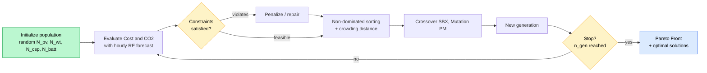

### 🎬 Optimization Scenarios

<div align="center">

| # | Name | RE Constraint | Battery | Purpose |
|:---:|:---|:---|:---:|:---|
| **1** | 100% RE + Battery (No Utility) | `RF = 100%` | ✅ | Test grid independence |
| **2** | 50–100% RE + Utility (No Battery) | `50% ≤ RF ≤ 100%` | ❌ | Realistic transition pathway |
| **3** | 0–30% RE + Utility (No Battery) | `RF ≤ 30%` | ❌ | Low‑adoption baseline |

</div>

---

## 📈 Optimization Results — Tampa Bay

<p align="center">
  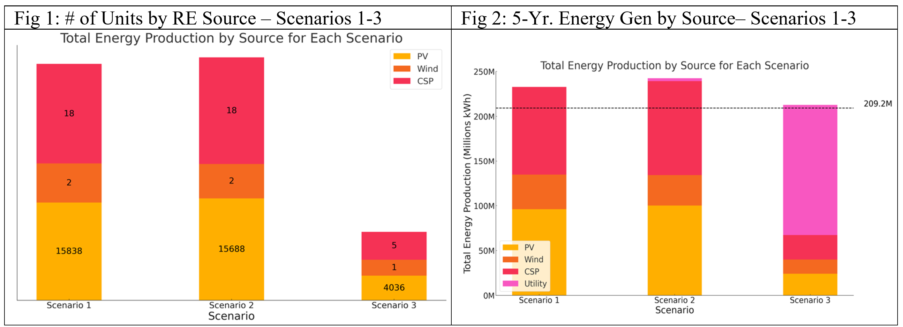
  <br/><em><b>Left:</b> Optimal number of units by RE source. <b>Right:</b> 5‑year total energy production. Dashed line = total demand (209.2 M kWh).</em>
</p>

<p align="center">
  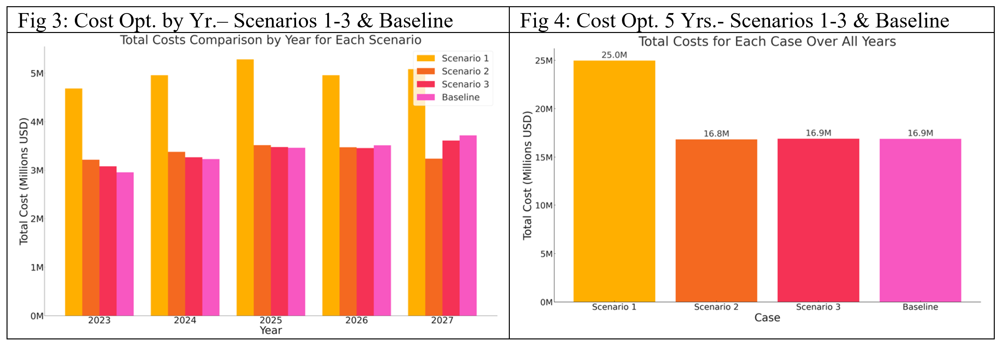
  <br/><em><b>Left:</b> Annual cost by scenario (2023–2027). <b>Right:</b> 5‑year total cost. Scenarios 2 & 3 match the utility baseline; Scenario 1 is +40% due to battery cost.</em>
</p>

### 📋 Optimal Configurations (5‑year, Tampa)

<div align="center">

| Scenario | PV Panels | Wind Turbines | CSP Acres | Batteries | Wasted Energy |
|:---|---:|---:|---:|---:|---:|
| **1 — 100% RE + Battery** | 15,838 | 2 | 18 | 12 | 11% |
| **2 — 50–100% RE** | 15,688 | 2 | 18 | 0 | 15% |
| **3 — 0–30% RE** | 4,036 | 1 | 5 | 0 | 0% |

</div>

> ### 💡 Why hybrid wins
>
> - **PV + CSP:** PV provides immediate daytime electricity; CSP with **10‑hour molten‑salt storage** shifts solar energy into the night.
> - **Solar + Wind:** Wind is often strong at night and during cloudy periods, complementing solar intermittency.
> - **Batteries** add cost but provide **energy independence** and protection against utility price volatility — increasingly attractive as states like California eliminate net metering.

---

## 🚀 Quick Start

### 🅰️ Interactive Optimization App (`moo-ui`)

A Dash app where you upload RE production, plant demand, and constants CSVs, choose a scenario, and view a Pareto front of cost vs. CO₂ trade‑offs.

```bash
cd moo-ui
pip install -r requirements.txt
python application.py                # → http://127.0.0.1:8080
```

Or with Docker:

```bash
cd moo-ui
docker build -t moo-ui .
docker run -p 8080:8080 moo-ui       # → http://127.0.0.1:8080
```

<details>
<summary><b>📥 Required CSV inputs</b></summary>

| File | Columns |
|---|---|
| RE Production | `datetime, Ppv, Pw, Pcs` |
| Plant Demand | `datetime, PF` |
| Constants | `Constant, Value` (LCOE_*, CO2_*, BATTERY_CAPACITY, …) |

A ready‑to‑use Tampa sample lives in [`Optimization Data/Tampa_Projected.csv`](Optimization%20Data/Tampa_Projected.csv) and [`Optimization Data/Tampa_Constants.xlsx`](Optimization%20Data/Tampa_Constants.xlsx). Templates are also downloadable from inside the app.

</details>

### 🅱️ Weather Forecasting App (`weather_interface`)

```bash
cd weather_interface
pip install streamlit pandas numpy plotly xgboost skforecast prophet matplotlib
streamlit run app_final_3.py
```

Pulls 20+ years of hourly NSRDB data via the NREL API, fits the XGBoost Average Method, and forecasts temperature / DNI / wind speed for any geographic point.

### 🅲 Reproduce the Per‑Plant Forecasts

Each plant has a self‑contained Jupyter notebook with saved models (`*.pkl`) and forecast CSVs:

```bash
jupyter notebook "Time series forecasting/Tampa/Tampa_Pred.ipynb"
```

---

## 📂 Repository Layout

```
Decarbonization-Study/
├── 📄 docs/papers/                      # ⭐ Publications & slides (NEW)
│   ├── IDRA-WC-2024-Sanan-Decarbonizing-Desalination.pdf
│   ├── IEEE-SusTech-2024-Sanan-Forecasting-RE-Desalination.pdf
│   └── IDRA-2024-Optimization-Presentation.pptx
├── 🖼  docs/images/                     # Figures used throughout this README
│
├── 🟢 moo-ui/                           # Dash app — multi‑objective optimization
│   ├── application.py                  # UI: upload, configure, view Pareto front
│   ├── main_opt.py                     # NSGA‑II driver (pymoo)
│   ├── utility.py                      # RenewableEnergyProblem · RE generation
│   ├── weather_forecast.py             # NSRDB ingestion + XGBoost forecaster
│   ├── convert_demand_to_hourly.py
│   ├── styles.py · test_calcs.py
│   ├── Dockerfile · requirements.txt
│   └── README.md
│
├── 🟠 weather_interface/                # Streamlit weather forecasting app
│   ├── app_final.py · app_final_2.py · app_final_3.py
│   ├── *_diff_average_model.joblib     # Trained skforecast XGBoost models
│   ├── Input Data/                     # Sample location CSVs
│   └── *.csv · database.db
│
├── 📓 Time series forecasting/          # Per‑plant ops forecasting notebooks
│   ├── Tampa/         · Tampa_Pred.ipynb           + best_gb_model_*.pkl + *.png
│   ├── Almeda/        · Almeda.ipynb               + TDS Readings/
│   ├── Kay Bailey/    · Kay Bailey.ipynb           + 50‑50 split variant
│   └── San Antonio/   · San Antonio.ipynb
│
├── 📓 Hydro Pred Updated/               # USGS hydropower forecasting notebooks
│   ├── Tampa/         · hydro_data_prediction_Tampa2.ipynb
│   ├── Almeda/        · Discharge + Gage Height CSVs
│   ├── Kay Bailey/    · Rio Grande / Narrows hydrology
│   └── San Antonio/   · SAWS hydrology
│
├── 📓 Hydro Pred/                       # Earlier hydropower exploration
│
├── 📊 Desal Plant Data/                 # Raw plant operating data + weather (NSRDB)
│   ├── Tampa/         · Almeda/ · San Antonio/ · Binney/ · Millwood/
│   └── DesalData/     · Industry‑wide reference (price, SEC, energy/water)
│
├── 📊 Optimization Data/                # Tampa‑projected hourly inputs ready for moo-ui
│   ├── Tampa_Projected.csv             # datetime, wind, temp, dni, hydro, P_*, demand
│   └── Tampa_Constants.xlsx
│
├── 📓 Data Analysis/                    # Cross‑cutting visuals (Visuals_Set_1/2)
│
├── 📄 LICENSE  (MIT)
└── 📄 README.md
```

---

## 🔧 Configuration Reference

The `Constants` CSV consumed by `moo-ui` includes:

<details>
<summary><b>Click to expand all constants</b></summary>

| Constant | Meaning | Source / Typical Value |
|---|---|---|
| `LCOE_pv` / `LCOE_wind` / `LCOE_csp` / `LCOE_batt` / `LCOE_util` | Levelized cost of energy (per kWh) | NREL ATB 2023 |
| `CO2_pv` / `CO2_wind` / `CO2_csp` / `CO2_batt` / `CO2_util` | Lifetime emissions intensity | NREL LCA |
| `Cost_day_pv` / `Cost_day_wind` / `Cost_day_csp` | Daily fixed cost per unit (CAPEX + FOH amortized) | derived |
| `LCOE_csp_kwt` | Variable CSP cost per kWh thermal | NREL ATB |
| `BATTERY_CAPACITY` | Storage per battery unit (kWh) | 600 |
| `Ndays_per_month` | Used in monthly aggregation | 30 |
| `CO2_ton_per_gal` | Conversion factor for emissions reporting | 103.5 |

</details>

NSGA‑II hyperparameters live at the top of [`moo-ui/main_opt.py`](moo-ui/main_opt.py). Per‑unit search‑space upper bounds: `xu = [50, 35, 60, 20]` for `[n_wt, n_pv·1000, n_csp, n_batt]`.

---

## 🔭 Limitations & Future Work

- 📊 Forecasted water/energy/weather inevitably carries uncertainty; downstream optimization inherits that uncertainty.
- 🛠 Plant **downtime** was not modelled separately when training operations forecasts.
- 🔌 The optimization currently assumes **no net metering** (worst‑case for energy independence); including net metering would reduce total cost in scenarios with excess RE.
- 🧪 Only **PV, Wind, CSP, and Battery Storage** are evaluated in the IDRA 2024 PSO results; **Geothermal** and **Hydrogen storage** are documented in the IEEE SusTech 2024 EMS architecture and are promising additions.
- 🔮 Future work: hourly **demand‑side management** (shifting desal load to cheap/clean hours), water‑storage co‑optimization, sensitivity analysis on the cost of carbon, and integration of geothermal/hydrogen storage into the optimization loop.

---

## 📝 Citation

If you use this code, data, or framework in your research, please cite **both** papers below.

<details open>
<summary><b>📄 IDRA World Congress 2024 (Optimization)</b></summary>

```bibtex
@inproceedings{sanan2024decarbonizing,
  title     = {Decarbonizing Water Desalination by Optimizing Renewable Energy
               and Battery Storage Using Optimization Algorithms},
  author    = {Sanan, Om and Sperling, Joshua and Greene, David and Greer, Ross},
  booktitle = {Proceedings of the IDRA World Congress 2024},
  year      = {2024},
  address   = {Abu Dhabi, UAE},
  publisher = {International Desalination and Water Reuse Association},
  note      = {REF: IDRAWC24-Sanan}
}
```

</details>

<details open>
<summary><b>📄 IEEE SusTech 2024 (Forecasting + EMS Architecture)</b></summary>

```bibtex
@inproceedings{sanan2024forecasting,
  title     = {Forecasting Weather and Energy Demand for Optimization of
               Renewable Energy and Energy Storage Systems for Water Desalination},
  author    = {Sanan, Om and Sperling, Joshua and Greene, David and Greer, Ross},
  booktitle = {2024 IEEE Conference on Technologies for Sustainability (SusTech)},
  year      = {2024},
  organization = {IEEE}
}
```

</details>

### Selected References (full list inside the papers)

1. UNU‑INWEH, *Global Water Security Assessment*, 2023.
2. H. Quon et al., "Pipe Parity Analysis of Seawater Desalination in the United States," *ACS EST Engg.*, 2022.
3. IRENA, *Renewable Power Generation Costs in 2022*.
4. NREL, [*Annual Technology Baseline*, 2023](https://atb.nrel.gov/electricity/2023/).
5. NREL, *Life Cycle Greenhouse Gas Emissions from Electricity Generation: Update*, 2021.
6. A. M. Abdelshafy, H. Hassan, J. Jurasz, "Optimal design of a grid‑connected desalination plant powered by RE using a hybrid PSO–GWO approach," *Energy Conversion and Management*, 2018.
7. J. A. Carta, P. Cabrera, "Optimal sizing of stand‑alone wind‑powered seawater RO plants," *Applied Energy*, 2021.

**Data sources used in this repository:**
- [NREL NSRDB (PSM3)](https://nsrdb.nrel.gov/) for hourly weather
- USGS Water Services for hydrology
- Direct plant operations data (Tampa Bay Water · SAWS · ACWD · El Paso Water/KBH)

---

## 📄 License & Acknowledgments

<table>
<tr>
<td width="50%" valign="top">

### License

Distributed under the **MIT License**. See [LICENSE](LICENSE) for full text.

</td>
<td width="50%" valign="top">

### Acknowledgments

Advised by:
- **Dr. Joshua Sperling** — NREL, New Concepts Incubator
- **David Greene** — Water/Energy/Climate engineer (formerly NREL)
- **Ross Greer** — UC San Diego ECE

Data contributed by **Tampa Bay Water · San Antonio Water System · Alameda County Water District · El Paso Water (KBH)**.

</td>
</tr>
</table>

---

<div align="center">

📬 **Contact:** [Om Sanan](mailto:om.sanan007@gmail.com) — GitHub [@anti-integral](https://github.com/anti-integral)

⭐ *If this work helps your research or project, please cite the papers and star the repository.* ⭐

<sub>Made with 🌊 + ⚡ + 🤖 to decarbonize water.</sub>

</div>
